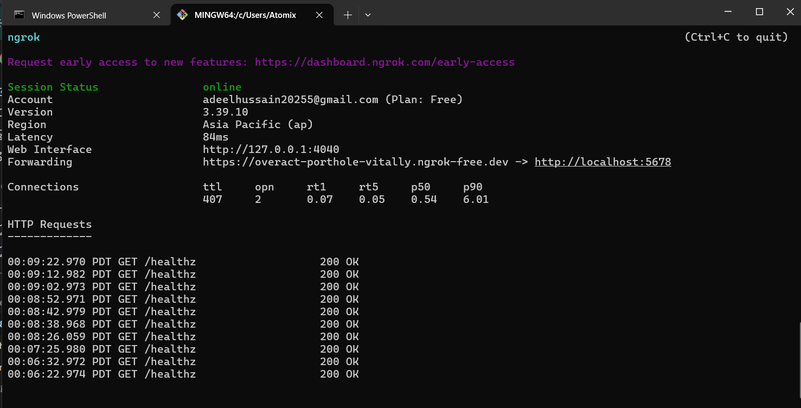
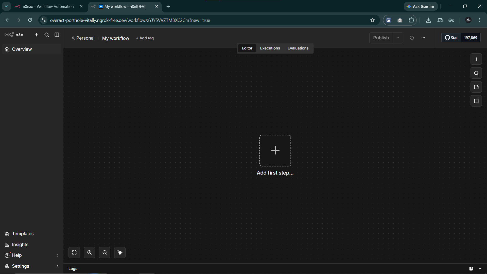

# DevSynt AI Automation Internship — Summer 2026

Welcome to the repository for my **AI Automation Internship** at **DevSynt**. This repository tracks my ongoing progress, workflow automation projects, and task deliverables throughout the program.

---

## 📌 Internship Information

| Field | Details |
| :--- | :--- |
| **Intern** | Adeel Hussain |
| **Track** | AI Automation |
| **Mentor** | Afnan Shoukat |
| **Repository** | `devsynt-ai-internship-adeel` |

---

## 🚀 Task 1: Local n8n Setup & Public Webhook Exposure

### Overview
Successfully configured a local **n8n** workflow automation environment, exposed it to the public internet via a persistent static **ngrok** reverse-proxy tunnel, and initialized this repository to track all internship deliverables.

---

### ⚙️ Environment Configuration

* **Local Instance:** `http://localhost:5678`
* **Public Domain:** `https://overact-porthole-vitally.ngrok-free.dev`
* **Runtime:** Node.js & npm

---

### 🛠️ Implementation Steps

#### 1. Local n8n Server Setup
Installed n8n globally using `npm` and initialized the local server instance on the default port (`5678`):

```bash
# Install n8n globally
npm install n8n -g

# Start the n8n instance
n8n start
```

> **Verification:** Verified local web UI accessibility by visiting `http://localhost:5678`.

#### 2. Static ngrok Tunnel Configuration
To allow external webhooks to hit the local n8n instance seamlessly without changing endpoints on restart:
1. Claimed a persistent static domain via the ngrok dashboard: `overact-porthole-vitally.ngrok-free.dev`.
2. Authenticated the local ngrok CLI.
3. Established a secure reverse-proxy tunnel targeting port `5678`:

```bash
ngrok http 5678 --url=overact-porthole-vitally.ngrok-free.dev
```


#### 3. Account Initialization & Verification
* Navigated to `https://overact-porthole-vitally.ngrok-free.dev` in the browser to confirm public routing.
* Completed the primary owner account registration (email, profile setup, and security credentials).
* Verified full access and execution functionality on the n8n visual workflow canvas.


---

## 📁 Repository Structure

```text
.
├── assets/      # Screenshots & visual proof of work
│   ├── n8n.png
│   └── ngrok.png
├── README.md
└── tasks/       # Upcoming automation workflows & export files
