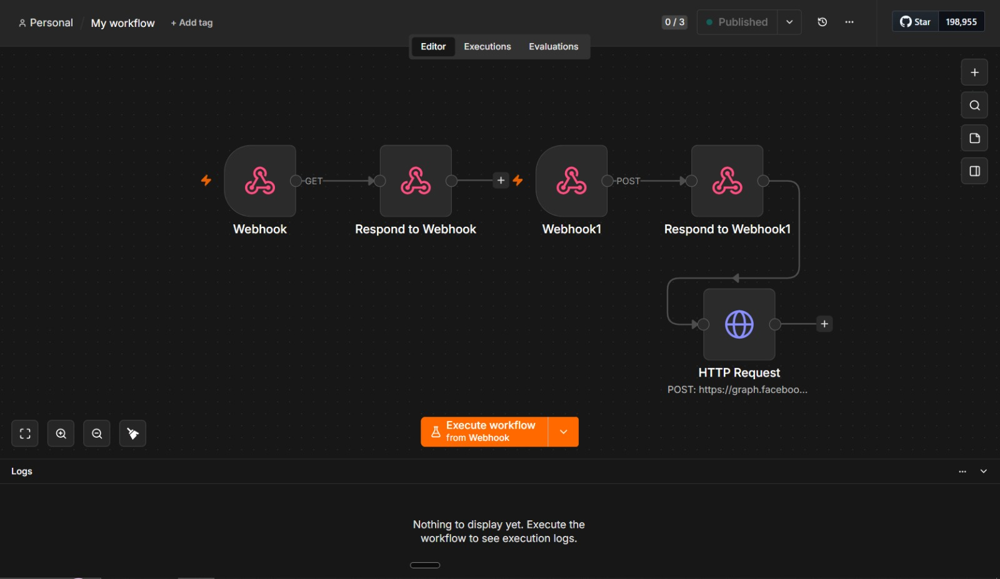
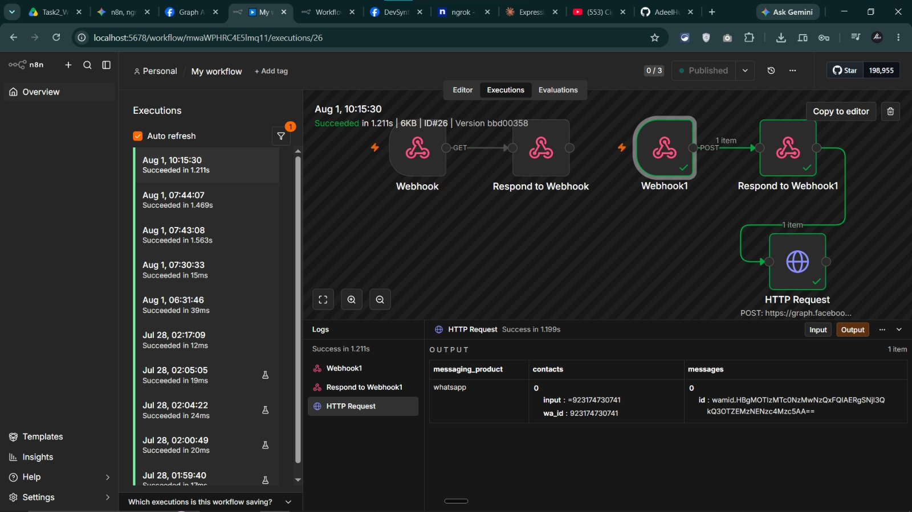
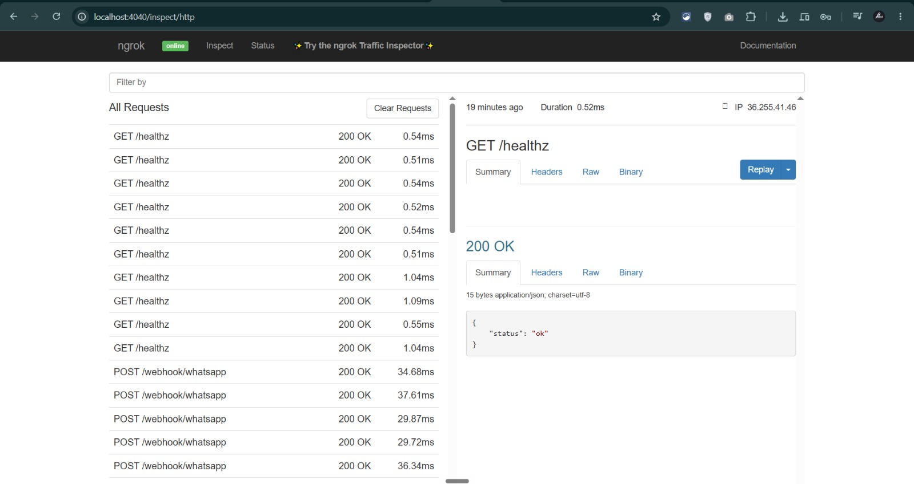
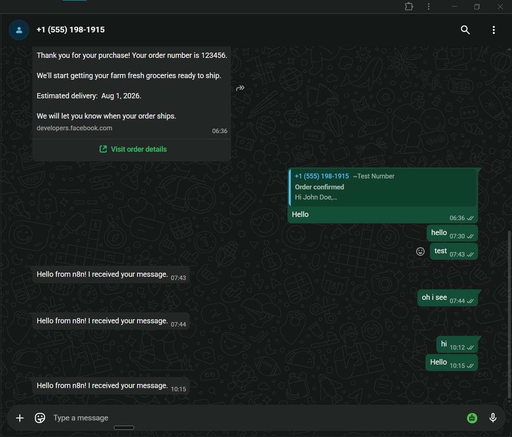

# DevSynt AI Automation Internship — Summer 2026

Hi there! Welcome to my official repository for the **DevSynt AI Automation Internship**. This space tracks my hands-on progress, system architectures, exported workflows, and documentation for every task throughout the program.

---

## 📌 Internship Overview

| Field | Details |
| :--- | :--- |
| **Intern** | Adeel Hussain |
| **Track** | AI Automation |
| **Mentor** | Afnan Shoukat |
| **Repository** | `DevSynt-AI-internship-Adeel` |

---

## 🚀 Task 1: Local n8n Setup & Public Webhook Exposure

### Overview
Before building complex automation pipelines, I needed a local environment capable of receiving real-time webhooks from external platforms like Meta. Since local servers (`localhost:5678`) can't be reached directly by public services, I configured a local **n8n** instance and connected it to a static **ngrok** reverse-proxy tunnel.

Think of webhooks like a digital mailbox—whenever an event happens online (like someone sending a WhatsApp message), WhatsApp needs an unchanging public address to "mail" that data to.

---

### ⚙️ Environment Specs

* **Local Instance:** `http://localhost:5678`
* **Static Public Tunnel:** `https://overact-porthole-vitally.ngrok-free.dev`
* **Runtime Environment:** Node.js & npm

---

### 🛠️ Step-by-Step Implementation

#### 1. Installing and Launching n8n
I installed n8n globally on my local machine using `npm` and launched the server on port `5678`:

```bash
# Install n8n globally
npm install n8n -g

# Start local server
n8n start
```

> **Check:** Opened `http://localhost:5678` in my browser to confirm the n8n editor UI was up and running locally.

#### 2. Locking in a Static ngrok Tunnel
To prevent my webhook URL from breaking every time I restarted my terminal, I reserved a permanent static domain on the ngrok dashboard and authenticated my local CLI:

```bash
ngrok http 5678 --url=overact-porthole-vitally.ngrok-free.dev
```

This established a secure, persistent bridge routing public traffic straight to port `5678` on my computer.


#### 3. Public Verification & Account Setup
* Tested public routing by opening `https://overact-porthole-vitally.ngrok-free.dev` in my browser.
* Registered my primary admin account and verified full access to the n8n visual canvas.


---

## 🚀 Task 2: WhatsApp Lead-to-Booking System (Phase 1)

### Overview
For my capstone project, I am building an automated WhatsApp lead-handling system for **Apex Dental Care**. 

Phase 1 focuses on architecting the full conversation logic on paper and establishing the core technical foundation: a working, two-way connection between Meta's WhatsApp Cloud API Sandbox and my local n8n engine using the static ngrok tunnel built in Task 1.

---

### ⚙️ System Architecture & Parameters

| Parameter | Configuration |
| :--- | :--- |
| **Niche / Business** | Apex Dental Care (Healthcare / Dental Clinic) |
| **Primary Languages** | Urdu & English (Bilingual with Mid-Chat Auto-Switching) |
| **Messaging Platform** | Meta WhatsApp Cloud API (Sandbox Mode) |
| **Webhook Tunnel** | `https://overact-porthole-vitally.ngrok-free.dev/webhook/whatsapp` |
| **Automation Engine** | n8n Workflow Automation |
| **API Version** | Meta Graph API `v20.0` |

---

### 🧠 System Design & Logic Rules

#### 1. Conversation Flow & State Management
Before touching n8n, I mapped out the entire conversation lifecycle from initial contact to appointment booking:
* **State 0 (Language Check):** Detects whether the inbound message is in English or Urdu script.
* **State 1 (Greeting & Intent):** Greets the user, asking if they want to book an appointment or ask a question.
* **State 2 (Service Selection):** Identifies the specific dental service needed (e.g., teeth cleaning, checkup, root canal).
* **State 3 (Preferred Timing):** Captures the patient's preferred day and time frame.
* **State 4 (Slot Proposals):** Offers available appointment slots (mocked for Phase 1; calendar API sync comes in Phase 2).
* **State 5 (Booking Confirmation):** Summarizes the booking details and confirms the slot.

#### 2. Mid-Conversation Language Detection
* The system evaluates inbound message payloads at State 0 for script characteristics (Urdu/Arabic characters vs. Latin script).
* If a patient starts in English and switches to Urdu mid-conversation, the bot dynamically updates the session state and responds in Urdu from that point forward.

#### 3. Human Handoff Guardrails
* **Why Handoff Matters:** AI bots should never attempt to diagnose medical symptoms, improvise clinical advice, negotiate custom pricing, or handle angry complaints.
* **Escalation Trigger:** Any off-script inquiry or medical question immediately pauses automated responses and routes the conversation state to a human receptionist.

#### 4. Follow-Up Nudges & Meta Policy Rules
To handle silent users, the design includes 3 progressive follow-up nudges:
* **+1 Hour Nudge:** Soft free-form check-in message.
* **+24 Hours & +72 Hours Nudges:** Must use Meta-approved Message Templates because Meta restricts free-form customer service replies after a 24-hour window from the user's last message.

#### 5. 🔐 Security & Secret Management
> **IMPORTANT SECURITY NOTE:** Never commit Meta Graph API Access Tokens, Phone Number IDs, or Webhook Verify Tokens directly to public GitHub repositories.  
> All sensitive tokens belong in n8n Environment Variables (`.env`) or internal n8n credential stores. Placeholders are maintained in `config.json` for repository safety.

---

### 🛠️ How I Built This (Step-by-Step Execution)

Here is the exact practical process I went through to take Phase 1 from concept to a working prototype:

#### Step 1: Mapping the Flowchart (`flow.mmd`)
I translated the conversation states (State 0 through State 5, nudges, and human handoff) into a clear visual diagram using Mermaid syntax (`flow.mmd`).

#### Step 2: Drafting the Message Scripts (`messages.md`)
I wrote out all 9 required conversation scenarios in both English and Urdu (18 total message templates) in `messages.md`. I kept the tone warm, clear, and natural—the way a real dental receptionist would speak.

#### Step 3: Setting Up Meta WhatsApp Cloud API
1. Created a Meta Developer account and initialized a new app with the **WhatsApp** product.
2. Obtained a temporary Access Token, Phone Number ID, and Sandbox Test Number from the dashboard.
3. Added my personal phone number to the sandbox recipient list to test live messaging.

#### Step 4: Building the Webhook Handshake (`GET`) in n8n
1. Added a **Webhook** node in n8n set to `GET` mode at `/webhook/whatsapp`.
2. Linked a **Respond to Webhook** node to return Meta’s verification challenge (`hub.challenge`).
3. In Meta's Developer Dashboard under WhatsApp $\rightarrow$ Configuration, pasted my full ngrok URL:  
   `https://overact-porthole-vitally.ngrok-free.dev/webhook/whatsapp`
4. Entered my custom Verify Token, verified the connection, and subscribed to the `messages` event field.

#### Step 5: Handling Inbound Messages & Outbound Replies (`POST`)
1. Configured the n8n Webhook node to listen for `POST` requests when users message the WhatsApp sandbox.
2. Connected an **HTTP Request** node in n8n configured to hit Meta's Graph API:
   `POST https://graph.facebook.com/v20.0/{PHONE_NUMBER_ID}/messages`
3. Formatted the request body with Bearer Token authentication and dynamic JSON payloads to send instant automated replies back to the sender's phone number (`wa_id`).

#### Step 6: Decoupling Clinic Config (`config.json`)
To ensure this automation can be deployed for other clients without rewriting logic, I created `config.json` containing reusable parameters (clinic name, services list, reminder times, and placeholder credential keys).

#### Step 7: Live Testing & Verification
I sent test messages from my phone to the WhatsApp Sandbox number, watching the execution logs in n8n turn green (`200 OK`) as my local workflow processed incoming webhooks and dispatched replies.

---

### 📁 Task Deliverables & Files

All Task 2 deliverables are modularly organized inside the `tasks/task2-whatsapp-phase1/` directory:

* **Exported Workflow:** [`workflow.json`](./tasks/task2-whatsapp-phase1/workflow.json)
* **Clinic Configuration File:** [`config.json`](./tasks/task2-whatsapp-phase1/config.json)
* **Mermaid Flowchart:** [`flow.mmd`](./tasks/task2-whatsapp-phase1/flow.mmd)
* **Bilingual Message Scripts:** [`messages.md`](./tasks/task2-whatsapp-phase1/messages.md)

---

### 📸 Execution Proof & Proof of Work

#### 1. Visual Workflow Architecture
*The complete n8n workflow listening for incoming webhooks and dispatching Meta Graph API responses.*


#### 2. Webhook Execution Log
*Successful 200 OK status in n8n confirming valid inbound payload processing and response execution.*


#### 3. ngrok Live Tunnel Log
*Active reverse proxy monitoring real-time webhook calls with 200 OK response codes.*


#### 4. Live WhatsApp Sandbox Test
*End-to-end conversation proof showing messages sent from a phone and automated responses returned.*


---

## 📁 Repository Structure

```text
.
├── assets/           # Central repository for visual proofs & screenshots
│   ├── .gitkeep
│   ├── n8n-workflow-canvas.jpeg
│   ├── n8n.png
│   ├── ngrok-tunnel-status.jpeg
│   ├── ngrok.png
│   ├── webhook-test-screenshot.jpeg
│   └── whatsapp-reply-test.jpeg
├── tasks/            # Task deliverables & workflow exports
│   └── task2-whatsapp-phase1/
│       ├── config.json
│       ├── flow.mmd
│       ├── messages.md
│       ├── workflow.json
│       └── README.md
└── README.md         # Main internship documentation & progress log
```
