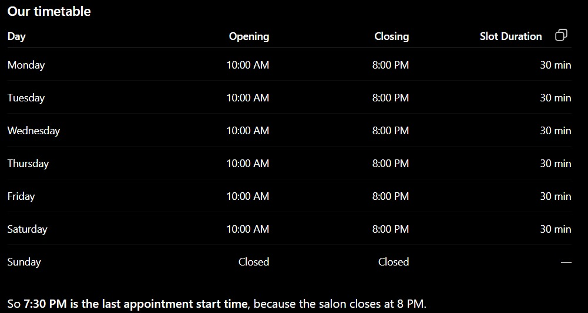
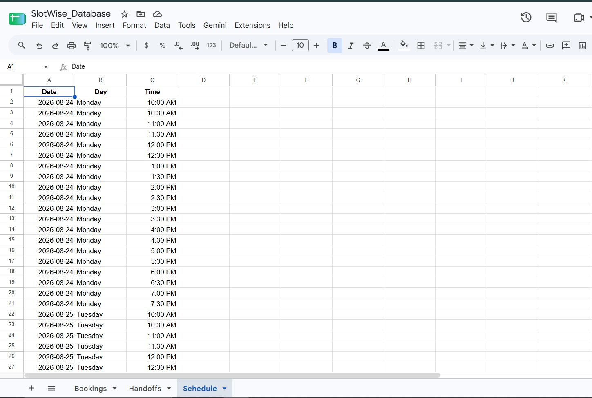

# SlotWise 🤖

### AI-Powered Telegram Booking Concierge

SlotWise is an AI-powered booking automation bot built as **Project 1** of my **DevSynt Summer Internship for AI Engineers**.

It uses **n8n, Google Gemini, Telegram, and Google Sheets** to handle salon appointment bookings through natural conversation.

Instead of using a fixed list of appointment times, SlotWise checks the salon's weekly schedule and existing bookings to calculate available slots before suggesting them to the user.

It can also recognize requests that are outside the booking flow, such as discount negotiations, complaints, or manager requests, and route them to a separate human handoff process.

---

## ✨ Features

- 🤖 AI-powered conversational booking
- 💬 Natural-language interaction through Telegram
- 🧠 Conversational memory using n8n Simple Memory
- 📅 Weekly salon schedule stored in Google Sheets
- 🔎 Availability calculation using schedule + existing bookings
- 🕐 Dynamic available-slot suggestions
- ✅ Booking confirmation before saving an appointment
- 📊 Automatic booking logging to Google Sheets
- 🧑‍💼 Human handoff for off-script requests
- 📝 Separate logging for handoff requests
- 🔀 Rule-based workflow routing
- 🔐 Credentials managed through n8n
- 🌐 Local development using ngrok

---

## 🏗️ Architecture

SlotWise combines an AI conversation layer with deterministic workflow automation.

````text
                         Telegram User
                              │
                              ▼
                    ┌──────────────────┐
                    │ Telegram Trigger │
                    └────────┬─────────┘
                             │
                  ┌──────────┴──────────┐
                  │                     │
                  ▼                     ▼
          ┌──────────────┐       ┌──────────────┐
          │ Get Schedule │       │ Get Bookings │
          │ Google Sheet │       │ Google Sheet │
          └──────┬───────┘       └──────┬───────┘
                 │                      │
                 └──────────┬───────────┘
                            ▼
                  ┌─────────────────────┐
                  │ Calculate           │
                  │ Availability        │
                  └──────────┬──────────┘
                             │
                             ▼
                  ┌─────────────────────┐
                  │ Format Availability │
                  └──────────┬──────────┘
                             │
                             ▼
                  ┌─────────────────────┐
                  │ AI Agent            │
                  │ Gemini + Memory     │
                  └──────────┬──────────┘
                             │
                             ▼
                  ┌─────────────────────┐
                  │ Telegram Bot API    │
                  └──────────┬──────────┘
                             │
                             ▼
                       ┌───────────┐
                       │  Switch   │
                       └─────┬─────┘
                             │
                    ┌────────┴────────┐
                    │                 │
                    ▼                 ▼
              ┌───────────┐     ┌───────────┐
              │  Booking  │     │  Handoff  │
              └─────┬─────┘     └─────┬─────┘
                    │                 │
                    ▼                 ▼
              Google Sheets      Google Sheets
               Bookings           Handoffs
````

### n8n Workflow


---

# 🔄 How It Works

## 1. User Starts a Conversation

The user interacts with SlotWise through Telegram.

For example:

````text
I want to book a haircut tomorrow.
````

The **Telegram Trigger** receives the message and starts the workflow.

---

## 2. SlotWise Checks the Schedule

The workflow reads the salon's weekly operating schedule from the `Schedule` Google Sheet.

The schedule contains available appointment slots for each day.

Example:

````text
Date        Day       Time
2026-08-24  Monday    10:00 AM
2026-08-24  Monday    10:30 AM
2026-08-24  Monday    11:00 AM
...
````

### Weekly Timetable



### Schedule Database



---

## 3. Existing Bookings Are Checked

The workflow also reads existing appointments from the `Bookings` sheet.

This allows SlotWise to distinguish between the salon's available schedule and slots that have already been booked.

````text
Salon Schedule
      +
Existing Bookings
      ↓
Available Slots
````

A slot that is already booked is removed from the available options.

---

## 4. Availability Is Calculated

The `Calculate Availability` node compares the salon schedule with existing bookings.

The resulting available slots are then processed by the `Format Availability` node before being passed to the AI Agent.

This means the bot does not simply return a hardcoded list of appointment times.

It uses the current data available in the Google Sheets database.

---

## 5. AI Agent Handles the Conversation

The AI Agent uses **Google Gemini** to understand the user's messages and guide the conversation.

It can handle information such as:

* Service
* Requested date
* Requested time
* Available alternatives
* User confirmation
* Out-of-scope requests

The agent also uses **n8n Simple Memory** to maintain conversational context between messages.

---

## 6. Available Slots Are Presented

If the requested time is unavailable, SlotWise can present the available slots for that date.

For example:

````text
The 4:00 PM slot is unavailable.

These slots are available:

- 3:30 PM
- 5:00 PM
- 6:30 PM

Which one works for you?
````

The user can then select one of the available options.

---

## 7. Booking Confirmation

Before the appointment is logged, the bot summarizes the booking and asks the user for confirmation.

Example:

````text
Service: Haircut
Date: Tomorrow
Time: 5:00 PM

Shall I finalize this booking?
````

Only after the user explicitly confirms does the workflow treat the appointment as completed.

---

# 📱 Telegram Demonstration

The complete booking conversation was tested through Telegram.

The test demonstrates:

1. Appointment request
2. Availability checking
3. Available slot suggestions
4. Slot selection
5. Booking summary
6. User confirmation
7. Successful booking
8. Out-of-scope request
9. Human handoff

### Telegram Conversation


---

# 📅 Booking Workflow

When a user confirms an appointment, the workflow routes the request through the `Booking` branch.

The booking is then stored in the `Bookings` Google Sheet.

## Bookings Database

The sheet contains:

| Field       | Description                     |
| ----------- | -------------------------------- |
| `Username`  | Telegram username or first name |
| `Service`   | Requested service               |
| `Date`      | Appointment date                |
| `Time`      | Appointment time                |
| `Status`    | Booking status                  |
| `Timestamp` | Time the record was created     |

A successfully completed appointment is stored with:

````text
Status: Confirmed
````


---

# 🔀 Workflow Routing

After the AI Agent processes the conversation, the workflow uses a **Switch node** to determine what should happen next.

````text
                    AI Agent
                       │
                       ▼
                 Telegram API
                       │
                       ▼
                    Switch
                  /         \
                 /           \
                ▼             ▼
            BOOKING         HANDOFF
                │             │
                ▼             ▼
         Bookings Sheet   Handoffs Sheet
````

This separates the AI conversation from the actual workflow control and data storage.

---

# 🧑‍💼 Human Handoff

SlotWise is not designed to handle every possible customer request.

If a user sends an off-script request, the bot can route the conversation to human support.

Examples include:

* Discount negotiations
* Complaints
* Manager requests
* Requests outside the booking flow
* Other situations requiring human intervention

For example:

````text
Can I get a 50% discount or speak to a manager?
````

SlotWise responds with a simple handoff message:

````text
Let me connect you with our team.
````

The request is then routed to the `Handoff` Google Sheets node.

---

## Handoff Database

The `Handoffs` sheet contains:

| Field          | Description                     |
| -------------- | -------------------------------- |
| `Username`     | Telegram username or first name |
| `User Message` | Original user request           |
| `Reason`       | Reason for escalation           |
| `Status`       | Handoff status                  |
| `Timestamp`    | Time the request was recorded   |

New handoff requests are stored as:

````text
Status: Pending Review
````


---

# 🧪 Testing

Both major workflow paths were successfully tested through n8n executions.

## Booking Test

### Execution #90

````text
Status: Succeeded
Duration: 10.522s
Execution ID: #90
````

Successful path:

````text
Telegram Trigger
       ↓
AI Agent
       ↓
HTTP Request
       ↓
Switch
       ↓
Log Booking
````


---

## Handoff Test

### Execution #93

````text
Status: Succeeded
Duration: 9.803s
Execution ID: #93
````

Successful path:

````text
Telegram Trigger
       ↓
AI Agent
       ↓
HTTP Request
       ↓
Switch
       ↓
Handoff
````


---

# 🧠 AI & Workflow Guardrails

The AI Agent handles natural-language conversation, but the n8n workflow controls what happens after the AI generates its response.

SlotWise uses internal control signals to identify workflow outcomes.

For example:

````text
[BOOKING_COMPLETE: Service="<Service>", Date="<Date>", Time="<Time>"]
````

indicates that a booking has been completed.

A handoff is identified using:

````text
[HANDOFF_TRIGGERED]
````

These internal signals are used for workflow routing and are removed before the final response is sent to the user.

This creates a separation between:

````text
AI Conversation
       ↓
Workflow Control
       ↓
Data Storage / Human Handoff
````

This approach makes the workflow more predictable and prevents internal control information from being shown to the user.

---

# ⚙️ Technical Implementation

A few implementation details were important for making the workflow reliable.

## Gemini Temperature

The Google Gemini Chat Model uses a temperature of `0`.

This helps make the AI's output more consistent, especially when the workflow depends on specific control tags.

## Structured Control Tags

The AI Agent is instructed to append specific control signals when a workflow action is completed.

Examples:

````text
[BOOKING_COMPLETE: Service="<Service>", Date="<Date>", Time="<Time>"]
````

and:

````text
[HANDOFF_TRIGGERED]
````

These tags are then detected by the downstream workflow.

## Item Pairing

The availability calculation can produce many slot items.

Because of this, downstream Google Sheets nodes use explicit `.first()` references when accessing data from nodes that produce multiple items.

This prevents n8n item-pairing issues when logging the final booking or handoff.

## Response Sanitization

Internal control tags are removed before the response is sent back to the Telegram user.

The user therefore sees a normal conversational response while the workflow can still use the internal signals for routing.

---

# 🛠️ Technology Stack

| Technology              | Purpose                                          |
| ------------------------ | ------------------------------------------------- |
| **n8n**                 | Workflow automation and orchestration            |
| **Google Gemini**       | Natural-language understanding and conversation  |
| **Telegram Bot API**    | User communication                               |
| **Google Sheets**       | Schedule, booking, and handoff data              |
| **n8n Simple Memory**   | Conversational context                           |
| **ngrok**               | Public HTTPS tunnel for local development        |
| **JavaScript / Regex**  | Availability processing and response parsing     |

---

# ⚙️ Setup

## Prerequisites

You will need:

* n8n
* Telegram account
* Telegram Bot
* Telegram Bot Token
* Google account
* Google Gemini API credentials
* Google Sheets credentials
* ngrok for local webhook development

---

## 1. Create a Telegram Bot

Open Telegram and start a conversation with:

````text
@BotFather
````

Create a new bot and obtain the Bot Token.

**Never commit the real Bot Token to GitHub.**

The `workflow.json` included in this repository is sanitized and should not contain the real token.

---

## 2. Create the Google Sheets Database

Create a spreadsheet named:

````text
SlotWise_Database
````

Create the following sheets.

### `Schedule`

Use:

````text
Date | Day | Time
````

Add the salon's weekly operating slots.

### `Bookings`

Use:

````text
Username | Service | Date | Time | Status | Timestamp
````

### `Handoffs`

Use:

````text
Username | User Message | Reason | Status | Timestamp
````

---

## 3. Configure n8n

Start your local n8n instance:

````text
http://localhost:5678
````

Import:

````text
workflow.json
````

Configure your own credentials for:

* Telegram
* Google Gemini
* Google Sheets

The repository does not contain private credentials.

---

## 4. Configure ngrok

If n8n is running locally on port `5678`:

````bash
ngrok http 5678
````

Use the generated HTTPS endpoint for webhook access during local development.

---

# 🔐 Security

This repository contains a sanitized n8n workflow.

**Never commit:**

````text
Telegram Bot Token
Google Gemini API Key
Google OAuth Credentials
Google Service Account Private Key
ngrok Auth Token
````

Use n8n's credential management system instead of hardcoding secrets into the workflow.

If a secret is accidentally exposed, revoke or rotate it immediately.

---

# 📁 Project Structure

````text
project1/
│
├── README.md
├── workflow.json
│
└── assets/
    ├── n8n-canvas.jpeg
    ├── n8n-execution-booking.jpeg
    ├── n8n-execution-handoff.jpeg
    ├── sheets-bookings.jpeg
    ├── sheets-handoffs.jpeg
    ├── sheets-schedule.jpeg
    ├── telegram-chat.jpeg
    └── timetable.jpeg
````

---

# 📦 Deliverables

### `workflow.json`

Sanitized n8n workflow export containing the SlotWise automation.

### `README.md`

Project documentation covering the architecture, workflow, setup, testing, and implementation.

### `assets/`

Screenshots documenting the working system:

* n8n workflow architecture
* Successful booking execution
* Successful handoff execution
* Google Sheets booking database
* Google Sheets handoff database
* Google Sheets schedule
* Telegram conversation
* Weekly salon timetable

---

# 🎯 What This Project Demonstrates

SlotWise demonstrates how an **LLM can be combined with deterministic workflow automation** to build a practical conversational system.

The AI is responsible for understanding the user's conversation, while n8n handles the actual workflow logic.

````text
User
 ↓
Natural Language
 ↓
Google Gemini
 ↓
n8n Workflow
 ↓
Availability + Routing
 ↓
┌───────────────┬────────────────┐
│               │                │
▼               ▼                ▼
Booking       Handoff        Data Storage
````

The project demonstrates practical experience with:

* LLM integration
* AI agents
* Prompt engineering
* Conversational memory
* Workflow automation
* API integration
* Google Sheets data handling
* Availability calculation
* Rule-based routing
* Human-in-the-loop workflows
* AI output control
* Basic security practices

---

# 📌 Project Status

**Working Prototype ✅**

The core booking and human-handoff workflows have been successfully tested through n8n.

The system currently supports:

* Telegram-based booking
* Weekly schedule management
* Existing-booking checks
* Available-slot calculation
* AI-assisted conversation
* Booking confirmation
* Booking logging
* Human handoff
* Handoff logging

---

# 👨‍💻 Author

**Adeel Hussain**

BSCS Student · AI & Generative AI Enthusiast

Built as part of the **DevSynt Summer Internship for AI Engineers**.

**Track:** AI Automation Engineering
**Project:** Project 1 - SlotWise
**Mentor:** Afnan Shoukat
**Format:** Individual Project

---

## 📄 License

No license has been specified for this project yet.