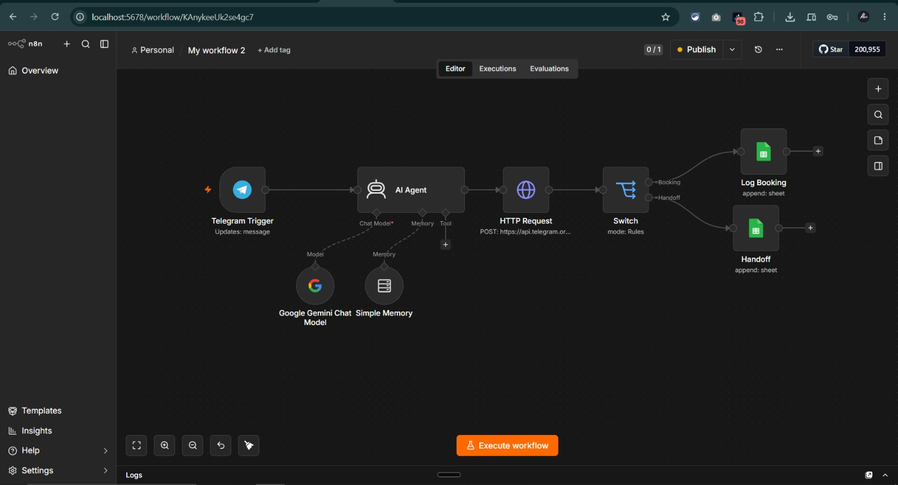
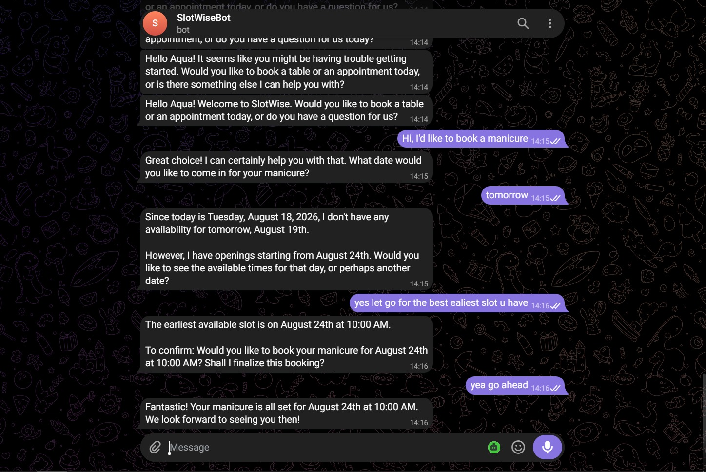
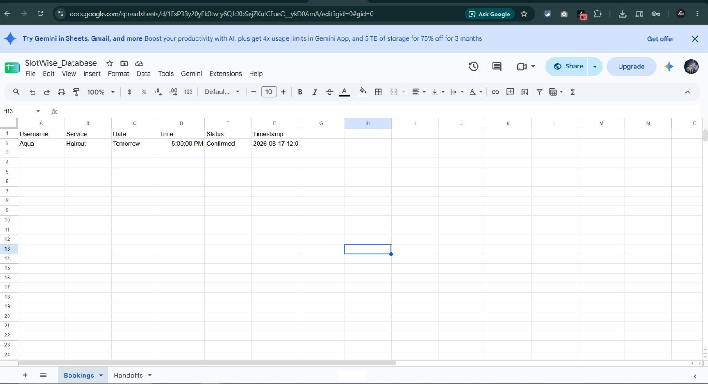
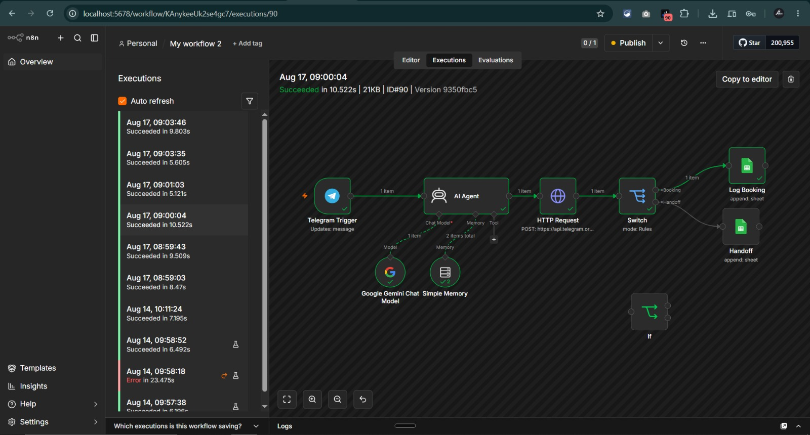
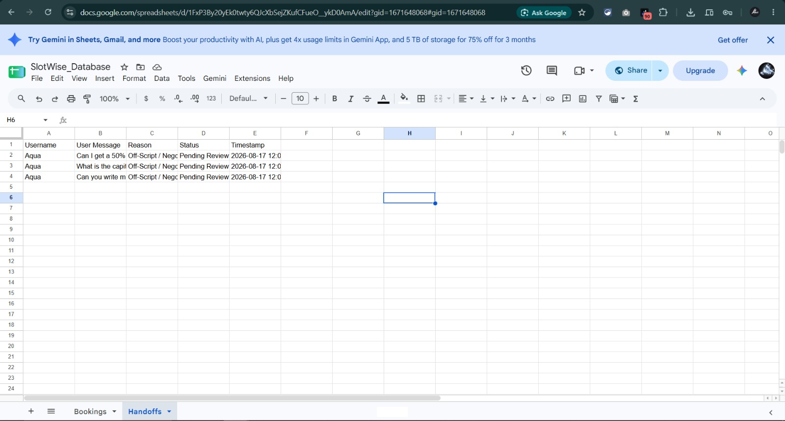
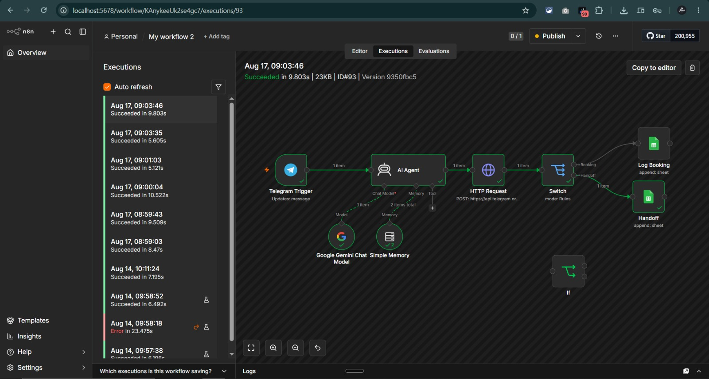

# SlotWise 🤖

### AI-Powered Telegram Booking Concierge

SlotWise is an AI-powered Telegram booking concierge built with **n8n, Google Gemini, Telegram Bot API, and Google Sheets**.

It can understand natural-language appointment requests, guide users through available booking options, confirm appointments, store booking records, and route out-of-scope requests such as discount negotiations or manager requests to a human-support queue.

---

## ✨ Features

* 🤖 AI-powered conversational booking
* 💬 Natural-language interaction through Telegram
* 🧠 Conversational memory using n8n Simple Memory
* 📅 Appointment information extraction
* 🔀 Automated booking vs. handoff routing
* 📊 Google Sheets-based booking database
* 🧑‍💼 Human handoff for out-of-scope requests
* 🧹 Response sanitization before sending messages to users
* 🔐 Credentials managed through n8n credentials
* 🌐 Local webhook exposure through ngrok

---

## 🏗️ Architecture

The current SlotWise workflow consists of:

```text
Telegram User
      │
      ▼
┌───────────────────┐
│ Telegram Trigger  │
└─────────┬─────────┘
          │
          ▼
┌────────────────────────┐
│ AI Agent               │
│                        │
│ Google Gemini          │
│ + Simple Memory        │
└───────────┬────────────┘
            │
            ▼
┌────────────────────────┐
│ HTTP Request            │
│ Telegram Bot API        │
└───────────┬────────────┘
            │
            ▼
┌────────────────────────┐
│ Switch Node             │
│ Mode: Rules             │
└───────────┬────────────┘
            │
       ┌────┴────┐
       │         │
       ▼         ▼
   Booking     Handoff
       │         │
       ▼         ▼
┌────────────┐ ┌────────────┐
│ Log Booking│ │  Handoff   │
│ Google     │ │ Google     │
│ Sheets     │ │ Sheets     │
└────────────┘ └────────────┘
```

### n8n Workflow



---

## 🔄 How It Works

### 1. User sends a message

The user interacts with SlotWise through Telegram.

For example:

```text
I want a haircut tomorrow at 4 PM.
```

The Telegram Trigger receives the message and passes it to the AI Agent.

### 2. AI Agent processes the conversation

The AI Agent uses **Google Gemini** together with **Simple Memory** to understand the conversation.

It can identify information such as:

* Service
* Requested date
* Requested time
* User confirmation
* Out-of-scope requests

If the requested time needs clarification or is unavailable, the agent can continue the conversation and offer alternatives.

### 3. Telegram response

The generated response is sent back through the **Telegram Bot API** using the HTTP Request node.

The workflow also sanitizes internal control information so that system tags are not exposed to the user.

### 4. Workflow routing

The Switch Node evaluates the AI Agent output and routes the interaction to one of two destinations:

```text
                    AI Agent Output
                          │
                          ▼
                     Switch Node
                     /          \
                    /            \
                   ▼              ▼
              BOOKING          HANDOFF
                   │              │
                   ▼              ▼
              Bookings         Handoffs
```

---

# 💬 Live Telegram Demonstration

The following conversation demonstrates a complete booking flow.

The user requests a haircut and initially asks for a time that requires checking. SlotWise responds with available options:

```text
3:30 PM
5:00 PM
6:30 PM
```

The user selects **5:00 PM**.

The agent summarizes the appointment and asks for confirmation.

After the user confirms, the booking is completed.

The same conversation then demonstrates an out-of-scope request:

```text
Can I get a 50% discount or speak to a manager?
```

Instead of attempting to negotiate or invent a discount, SlotWise responds:

```text
Let me connect you with our team.
```

The request is then routed to the human handoff workflow.

### Telegram Conversation



---

# 📅 Booking Workflow

When a valid appointment is completed, the Switch Node routes the data to the **Log Booking** Google Sheets node.

The `Bookings` sheet contains:

| Field       | Description                 |
| ----------- | --------------------------- |
| `Username`  | Telegram username           |
| `Service`   | Requested service           |
| `Date`      | Appointment date            |
| `Time`      | Appointment time            |
| `Status`    | Booking status              |
| `Timestamp` | Time the record was created |

A successful booking is stored with:

```text
Status: Confirmed
```

### Booking Database



---

# ✅ Verified Booking Execution

The booking workflow was successfully tested through n8n.

### Execution #90

```text
Status: Succeeded
Duration: 10.522s
Execution ID: #90
```

The execution shows the successful path through:

```text
Telegram Trigger
        ↓
AI Agent
        ↓
HTTP Request
        ↓
Switch
        ↓
Log Booking
```

### n8n Booking Execution



This execution provides proof that the booking route successfully reached the Google Sheets `Bookings` node.

---

# 🧑‍💼 Human Handoff Workflow

SlotWise is intentionally designed not to handle every possible request autonomously.

Requests outside the booking workflow can be escalated to human support.

Examples include:

* Discount negotiations
* Manager requests
* Requests outside the bot's defined scope
* Other situations requiring human intervention

When the AI Agent identifies such a request, the Switch Node routes it to the `Handoff` Google Sheets node.

The `Handoffs` sheet stores:

| Field          | Description                   |
| -------------- | ----------------------------- |
| `Username`     | Telegram username             |
| `User Message` | Original user request         |
| `Reason`       | Reason for escalation         |
| `Status`       | Current handoff status        |
| `Timestamp`    | Time the request was recorded |

New handoffs are recorded as:

```text
Status: Pending Review
```

### Handoff Database



---

# 🚨 Verified Handoff Execution

The human handoff path was also successfully tested.

### Execution #93

```text
Status: Succeeded
Duration: 9.803s
Execution ID: #93
```

The successful path is:

```text
Telegram Trigger
        ↓
AI Agent
        ↓
HTTP Request
        ↓
Switch
        ↓
Handoff
```

### n8n Handoff Execution



This confirms that the workflow can successfully separate normal bookings from requests requiring human intervention.

---

# 🧠 AI & Guardrails

The AI Agent is responsible for understanding the user's conversation, but the workflow itself controls what happens after the AI generates its output.

SlotWise uses internal control signals to distinguish between different workflow outcomes.

For example:

```text
[BOOKING_COMPLETE]
```

can indicate a completed booking, while:

```text
[HANDOFF_TRIGGERED]
```

can indicate a request that needs human intervention.

These internal control signals are removed from the user-facing response before it is delivered through Telegram.

This creates a separation between:

```text
AI Conversation Layer
        │
        ▼
Workflow Control Layer
        │
        ▼
Database / Human Handoff
```

---

# 🧩 Technology Stack

| Technology             | Purpose                                   |
| ---------------------- | ----------------------------------------- |
| **n8n**                | Workflow automation and orchestration     |
| **Google Gemini**      | Conversational AI                         |
| **Telegram Bot API**   | User communication                        |
| **Google Sheets**      | Booking and handoff storage               |
| **ngrok**              | Public HTTPS tunnel for local development |
| **JavaScript / Regex** | Response sanitization                     |

---

# ⚙️ Setup

## Prerequisites

Before running SlotWise, you need:

* [ ] n8n
* [ ] Telegram account
* [ ] Telegram Bot
* [ ] Telegram Bot Token
* [ ] Google account
* [ ] Google Gemini API credentials
* [ ] Google Sheets credentials
* [ ] ngrok for local webhook development

---

## 1. Create the Telegram Bot

Open Telegram and start a conversation with:

```text
@BotFather
```

Run:

```text
/newbot
```

Follow the instructions and copy the generated Bot Token.

**Never commit the Bot Token to GitHub.**

---

## 2. Create the Google Sheets Database

Create a spreadsheet named:

```text
SlotWise_Database
```

Create two tabs.

### `Bookings`

Use these headers:

```text
Username | Service | Date | Time | Status | Timestamp
```

### `Handoffs`

Use these headers:

```text
Username | User Message | Reason | Status | Timestamp
```

---

## 3. Configure n8n

Start n8n locally:

```text
http://localhost:5678
```

Import:

```text
workflow.json
```

Configure the required credentials for:

* Telegram
* Google Gemini
* Google Sheets

---

## 4. Configure ngrok

If your n8n instance is running locally on port `5678`:

```bash
ngrok http 5678
```

Use the generated HTTPS endpoint for your Telegram webhook configuration.

---

# 🔐 Security

**Do not commit secrets to this repository.**

Before pushing the workflow to GitHub, make sure the exported `workflow.json` does not contain:

```text
Telegram Bot Token
Google Gemini API Key
Google OAuth Credentials
Google Service Account Private Key
ngrok Auth Token
```

Use n8n's credential system or environment variables instead of hard-coding secrets.

If a credential is accidentally exposed, revoke or rotate it immediately.

---

# 📁 Project Structure

```text
project1/
│
├── README.md
├── workflow.json
│
└── assets/
    ├── n8n-canvas.jpeg
    ├── n8n-execution-booking.jpeg
    ├── n8n-execution-handoff.jpeg
    ├── sheets-bookings.jpeg
    ├── sheets-handoffs.jpeg
    └── telegram-chat.jpeg
```

---

# 📦 Deliverables

### `workflow.json`

Sanitized n8n workflow export containing the SlotWise automation.

### `assets/`

Screenshots documenting the working system:

* n8n workflow architecture
* Successful booking execution
* Successful handoff execution
* Telegram interaction
* Confirmed booking database
* Human handoff database

---


# 🎯 What This Project Demonstrates

SlotWise demonstrates how an LLM can be combined with deterministic workflow automation to build a practical conversational system.

The project separates responsibilities between the AI and the automation layer:

```text
┌──────────────────────────┐
│      User Conversation   │
└────────────┬─────────────┘
             │
             ▼
┌──────────────────────────┐
│       AI Agent           │
│   Understand the intent  │
└────────────┬─────────────┘
             │
             ▼
┌──────────────────────────┐
│       n8n Workflow       │
│    Control + Routing     │
└────────────┬─────────────┘
             │
        ┌────┴────┐
        ▼         ▼
     Booking    Handoff
        │         │
        ▼         ▼
    Database   Human Review
```

This approach allows the AI to handle natural conversation while deterministic workflow logic controls data storage and escalation.

---

# 👨‍💻 Author

**Adeel Hussain**

BSCS Student · AI & Generative AI Enthusiast

---

## ⭐ Project Status

**Working prototype**

The booking and human-handoff paths have been successfully tested through n8n executions **#90** and **#93**.

---

## 📄 License

No license has been specified for this project yet.
